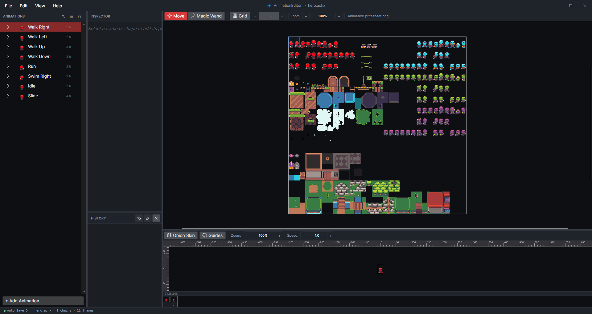
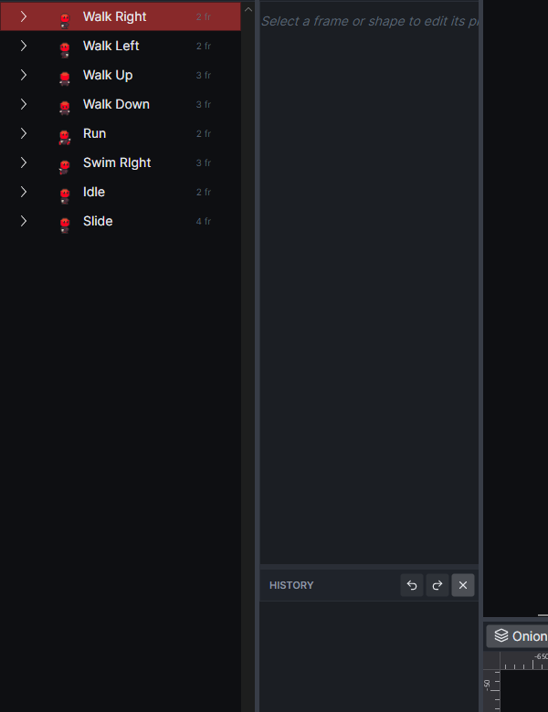
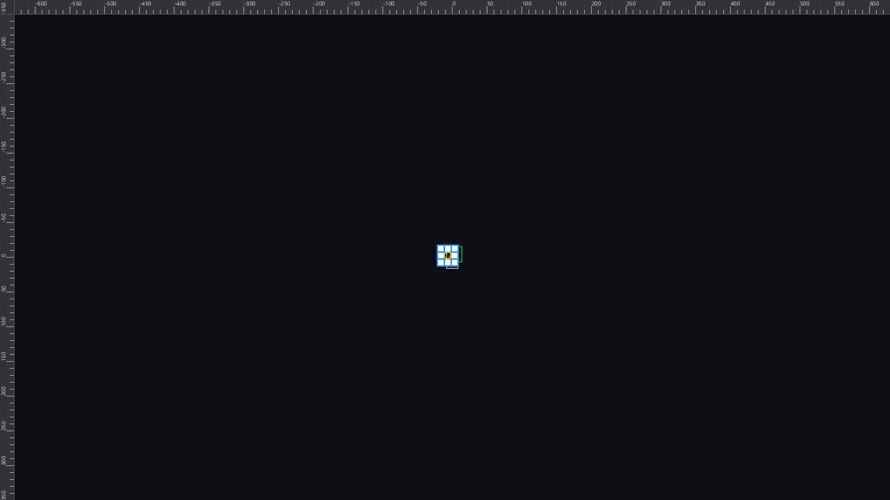
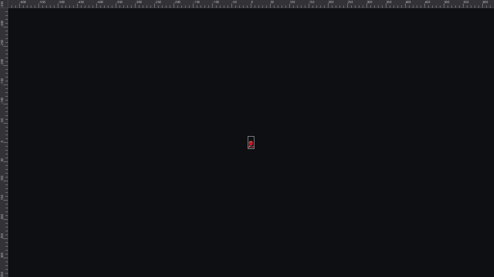
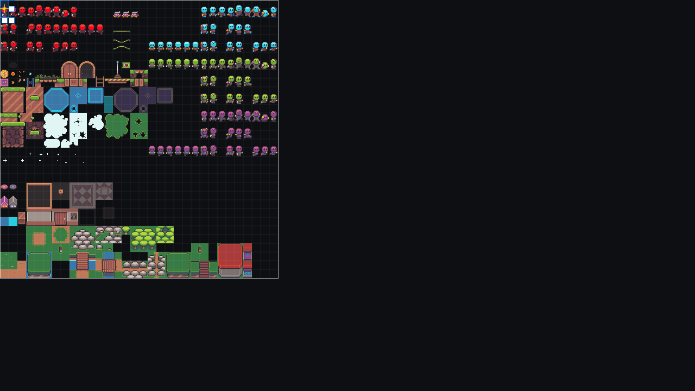

# Animation Editor User Guide

The Animation Editor is the Avalonia rewrite of the FlatRedBall animation tool. It edits `.achx` files, frame UVs, per-frame shapes, and playback settings in one place.

## Mental model

The editor uses two main panels:

- **Top panel:** wireframe and texture editing
- **Bottom panel:** animation preview and playback

Most workflows start in the tree view, then move between the wireframe and preview panels.

## Getting started

1. Open the editor.
2. Use **File > Open** or drag an `.achx` file into the app.
3. If you recently opened the file, pick it from **Recent Files**.
4. Select a chain in the tree view to begin editing frames.

You can also launch the app with an `.achx` file argument on startup.

## Chain management

An **Animation Chain** is the named sequence that holds frames.

Use chains when you want to group related animations such as `WalkLeft`, `WalkRight`, or `Jump`.

Common chain actions:

- Add, delete, rename, or reorder chains
- Duplicate a chain
- Flip a chain horizontally or vertically
- Invert frame order
- Set all frame lengths
- Sort chains alphabetically

The duplicate tools are useful for mirrored directions. For example, duplicate `WalkLeft` to create `WalkRight`.

## Frame management

A **Frame** stores the texture region, timing, flip flags, offsets, and any attached shapes.

Use frames to control what appears in the animation and for how long.

Common frame actions:

- Add, delete, rename, or reorder frames
- Set frame length
- Assign a texture
- Edit UV coordinates
- Set relative X/Y offsets
- Flip a single frame horizontally or vertically
- Duplicate a frame
- Add multiple frames at once

If your project uses sprite sheets, the texture viewer can help you select frame regions quickly.

## Shapes and collision boxes

Frames can own a **ShapeCollectionSave** with collision shapes. In the UI, this is the frame's ShapeCollection.

Supported shapes:

- Axis-aligned rectangles
- Circles

Use shapes when you need per-frame hitboxes, hurtboxes, or other collision data.

Common shape actions:

- Add a rectangle or circle
- Delete a shape
- Match a shape to the frame offset
- Edit size, position, and name
- Drag shapes directly in the wireframe

## Selection and navigation

Selection drives most editing.

- Select a chain to edit the whole animation
- Select a frame to edit UVs, timing, and shapes
- Select a shape to edit its properties
- Multi-select frames when you need batch operations

The tree view and property panels stay in sync with the current selection.

## Tree view navigation

The tree view is the fastest way to move through the file.

Use it to:

- Expand or collapse chains
- Select frames and shapes
- Rename items in place
- Open context menus for add/delete/reorder actions
- Multi-select frames

Tree state is saved with your editor settings, so expanded nodes can come back the next time you open the file.

## File I/O and recent files

The editor works with `.achx` files and a companion `.aeproperties` file.

File features:

- New file
- Open
- Save
- Save As
- Recent files list
- Load companion settings
- Save companion settings
- Export the current animation as GIF

Recent files are stored in the app and trimmed automatically.

Common tip: keep textures and the `.achx` file in the same project folder so relative paths stay clean.

## Playback and preview

The preview panel shows the current chain in motion.

Use it to:

- Play, pause, and stop
- Loop the animation
- Change playback speed
- Toggle flip preview
- Enable onion skin
- Change preview zoom
- Pan the preview camera
- Change sprite alignment

Onion skin helps compare the current frame to the previous one. It is especially useful for walk cycles and cleanup work.

## Wireframe, camera, zoom, and grid snap

The wireframe panel is where you adjust the selected frame and shapes.

Useful controls:

- Mouse wheel zoom
- Pan with mouse drag
- Snap to grid
- Change grid size
- Show or hide guide lines
- Switch unit type between pixel, texture coordinate, and sprite sheet

Avalonia-port improvements include a separate preview zoom, persistent guide settings, and better texture selection in the wireframe toolbar.

## Texture viewer and drag-and-drop

The texture viewer lets you inspect a PNG, zoom into cells, and select UV regions.

You can also drag textures onto the editor:

- Drop a PNG onto a frame to assign it to that frame
- Drop a PNG onto a chain to apply it to existing frames
- Hold Ctrl while dropping to create a new frame
- Drop non-PNG files and the editor ignores them

This is one of the fastest ways to build a chain from existing sprites.

## Undo and redo

Most editing commands are undoable.

Use undo and redo after:

- Chain edits
- Frame edits
- Shape edits
- Delete operations
- Drag-and-drop changes

If a batch operation does not look right, undo it before moving on.

## Avalonia-port features to know

The Avalonia rewrite adds or improves several workflows:

- Smart duplicate direction naming for mirrored chains
- Adjust Offsets and Scale Frame Times dialogs for bulk timing/position cleanup
- Batch-add multiple frames with optional coordinate incrementing
- Independent preview zoom and pan
- Onion skin in preview
- Persisted guide lines and tree expansion
- Recent file handling
- Copy and paste for chains, frames, and shapes
- Resize texture workflow
- GIF export
- Magic wand region creation for frame building

These features are aimed at making the editor faster for everyday content work.

## Workflow examples

### 1) Build a walk cycle

1. Open the `.achx` file.
2. Select or create a `WalkLeft` chain.
3. Add frames or duplicate an existing chain.
4. Set the frame order and frame lengths.
5. Use flip horizontal to create the mirrored direction.
6. Play the preview and adjust timing.

### 2) Add per-frame hitboxes

1. Select the frame you want to edit.
2. Add a rectangle or circle shape.
3. Drag the shape into place in the wireframe.
4. Resize it with the handles or edit the properties.
5. Repeat for each frame that needs a different hitbox.

### 3) Turn a spritesheet into frames

1. Open the texture viewer.
2. Select a region with the mouse or use the magic wand workflow.
3. Create a frame from the selected region.
4. Repeat for each animation cell.
5. Drag the PNG onto the chain if you want to assign the texture quickly.

### 4) Mirror an existing chain

1. Right-click a chain.
2. Choose Duplicate.
3. Accept the mirrored direction name if it matches your project.
4. Flip horizontally or vertically if needed.
5. Rename and fine-tune the frame offsets.

## Troubleshooting

### My texture does not show up

- Make sure the frame has a texture assigned.
- Check that the texture file exists in the project folder.
- Confirm the PNG is referenced by the loaded `.achx`.

### My hitbox moved unexpectedly

- Check the selected frame before editing shapes.
- Look for snap-to-grid or guide settings.
- Undo the last change if the move was accidental.

### The preview looks wrong

- Check chain flips and frame flip flags.
- Verify frame order and frame length.
- Try resetting preview zoom or pan.

### My file did not save

- Make sure the `.achx` path is valid.
- If save fails, try Save As to a new location.
- Check for file locks if another app is using the file.
