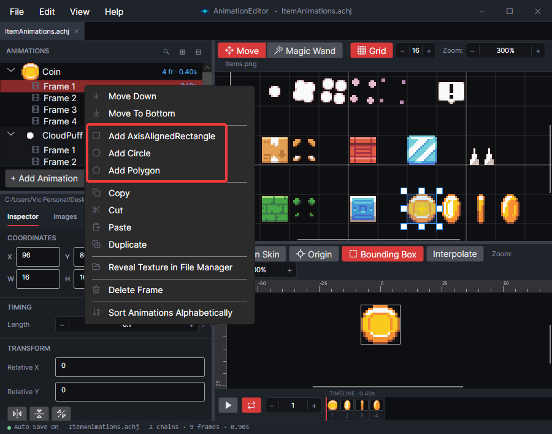
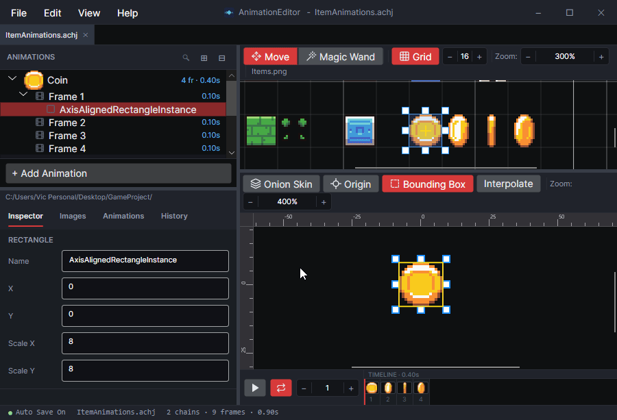
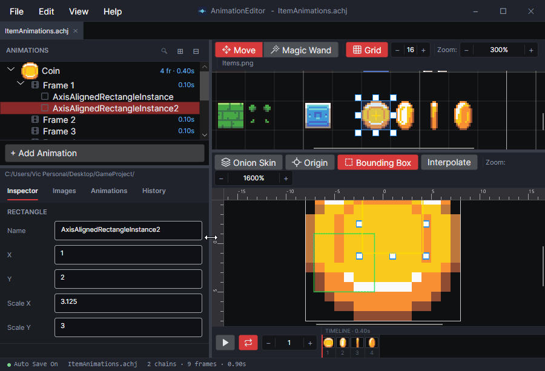
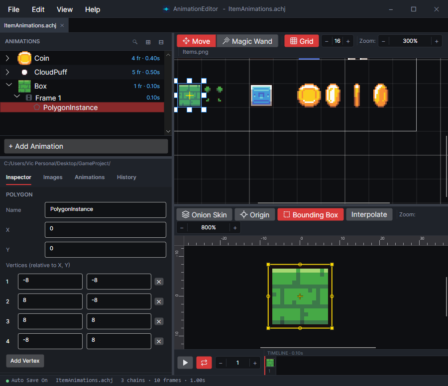
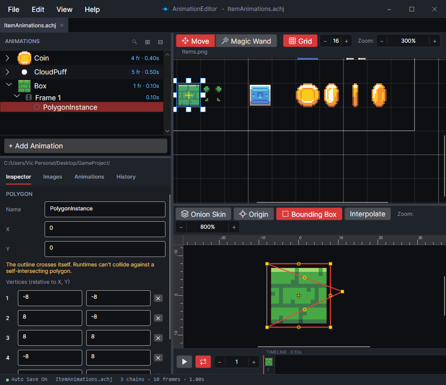

# Add Shapes to Frames

### Frame Shapes

Frames support holding multiple shapes. The three types of shapes supported are:

* Rectangle
* Circle
* Polygon

These shapes can be used to define an object's collision or mark spots relevant to your game such as bullet origin.

### Adding Shapes

To add a shape, right-click on an existing frame and select the option to add one of the types of shapes:

<figure><figcaption></figcaption></figure>

Shapes appear in the bottom preview tab when viewing a frame or animation.

<figure><figcaption>
Rectangle in a frame
</figcaption></figure>

### Editing Shapes

Shapes can be edited by changing the position and size variables in the Inspector tab, or by editing the shape in the preview tab.

<figure><figcaption>
Editing a Shape in the preview window
</figcaption></figure>

If multiple shapes are added to a frame, they can be selected in the animation list or in the preview tab. Note that clicking on overlapping shapes cycles between them.

<figure><figcaption>
Selecting overlapping shapes
</figcaption></figure>

### Polygons

Polygons provide additional flexibility in the form of supporting multiple arbitrary points.

<figure><figcaption>
Polygon on a shape
</figcaption></figure>

Polygon points can be edited in the Inspector or by clicking and dragging in the preview tab.

To delete a point, click on its X button in the Inspector, or highlight the point and click the delete key on the keyboard.

Polygons can be convex or concave, but the polygon should not cross over itself. If so, it is marked red to indicate an error.

<figure><figcaption>
Invalid polygon crossing over itself
</figcaption></figure>

