# Edit Animations

## Add an Animation

To add an animation to an existing file, click the **Add Animation** button.

<figure>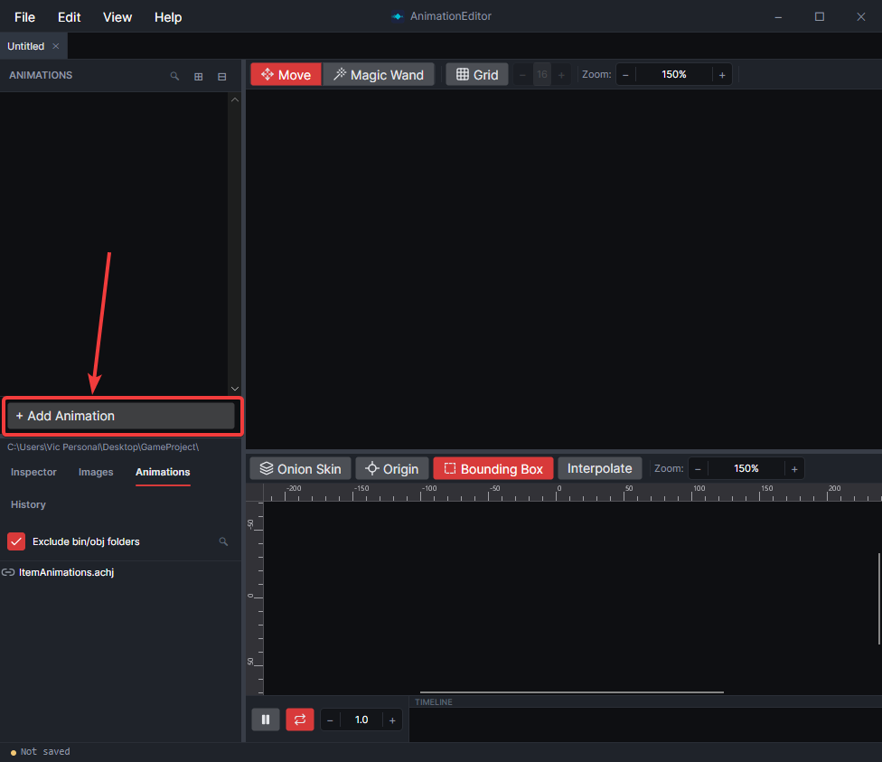<figcaption></figcaption></figure>

You can also right-click in the animation list and select **Add Animation**.

<figure>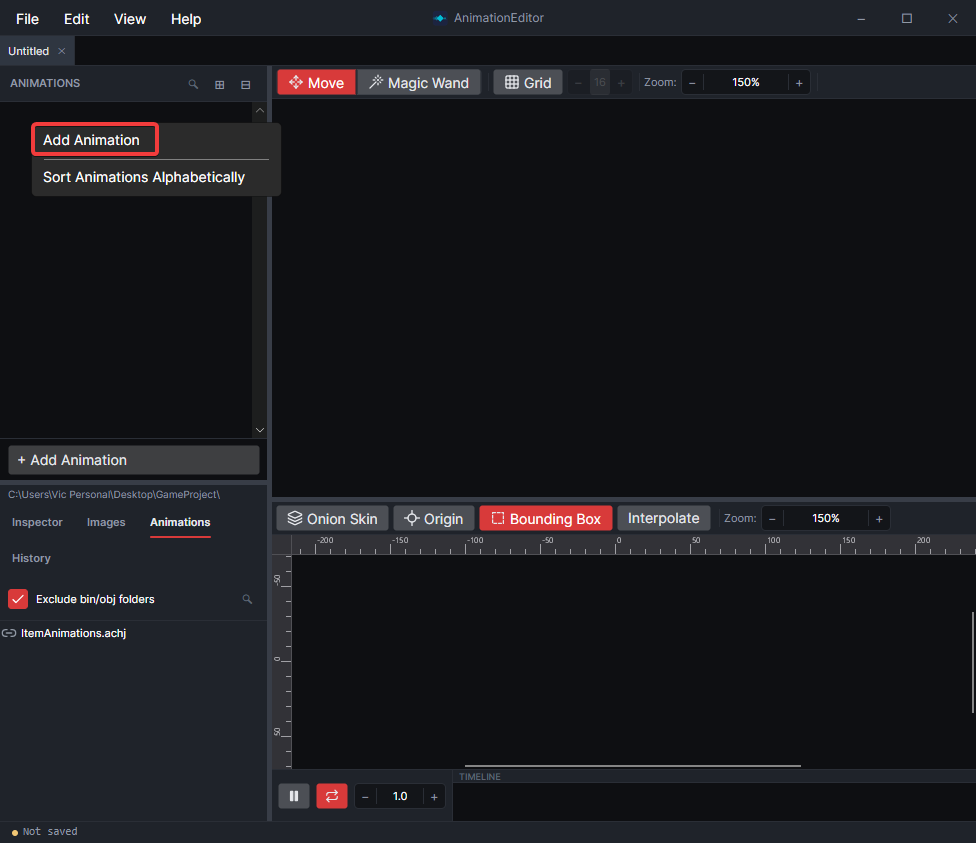<figcaption></figcaption></figure>

## Rename an Animation

To rename an animation, select the animation, then change its name in the **Inspector** tab.

<figure>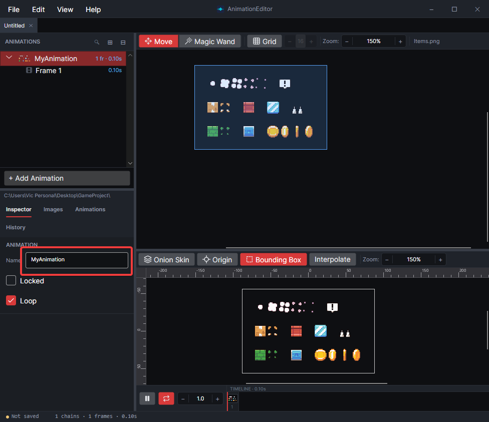<figcaption></figcaption></figure>

Alternatively, double-click the name of the animation, press **F2** (**Fn+F2** on Mac laptops), or right-click the animation and select **Rename…**.

## Delete an Animation

To delete an animation, right-click the animation and select **Delete Animation**.

<figure>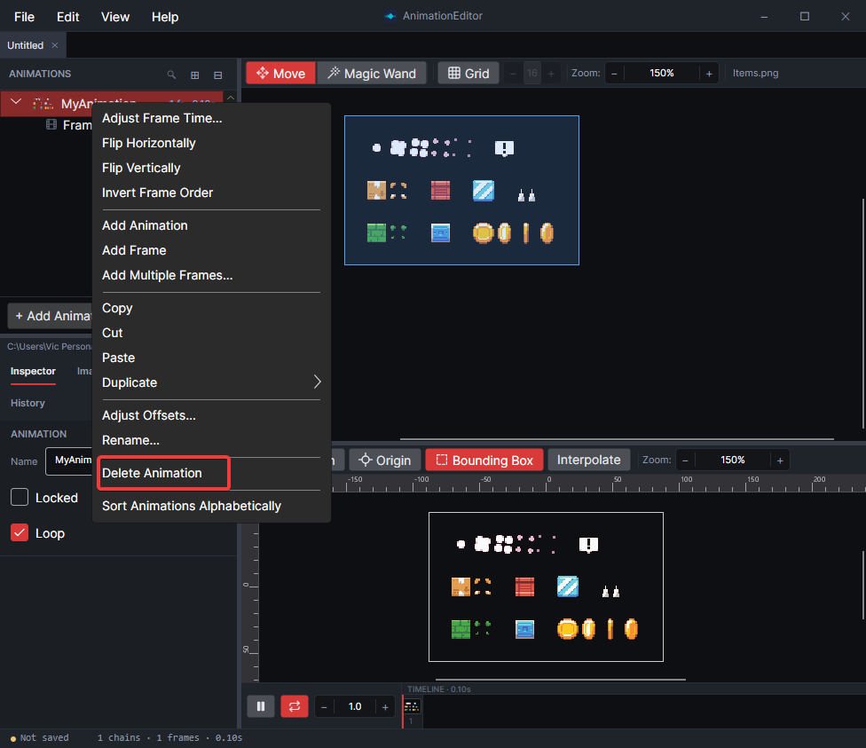<figcaption></figcaption></figure>

Alternatively, press **Delete** (**Fn+Delete** on Mac laptops), or press **Ctrl+X** (**⌘X** on macOS) to cut the animation if you intend to paste it elsewhere.

## Reorder Animations

To reorder an animation, drag it to its new position in the list.

<figure>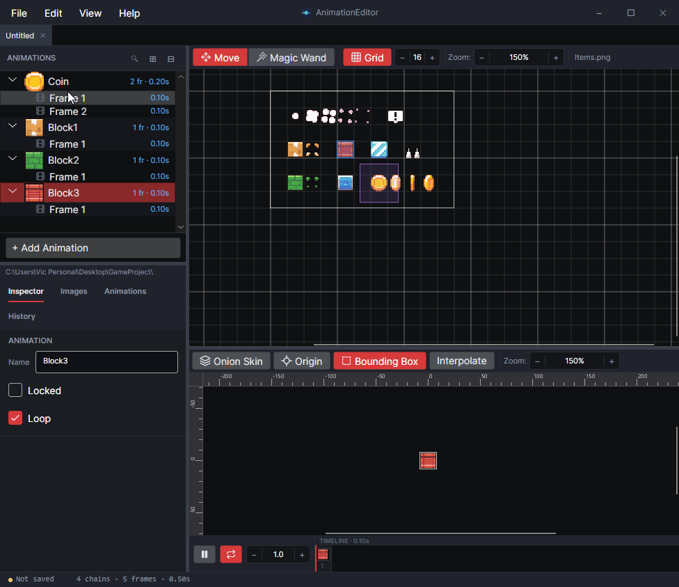<figcaption></figcaption></figure>

Alternatively, hold down **Alt** (**⌥ Option** on macOS) and press the **Up** or **Down** arrow key.

## Duplicate an Animation

To duplicate an animation, right-click the animation and select **Duplicate ▸ Original**.

<figure>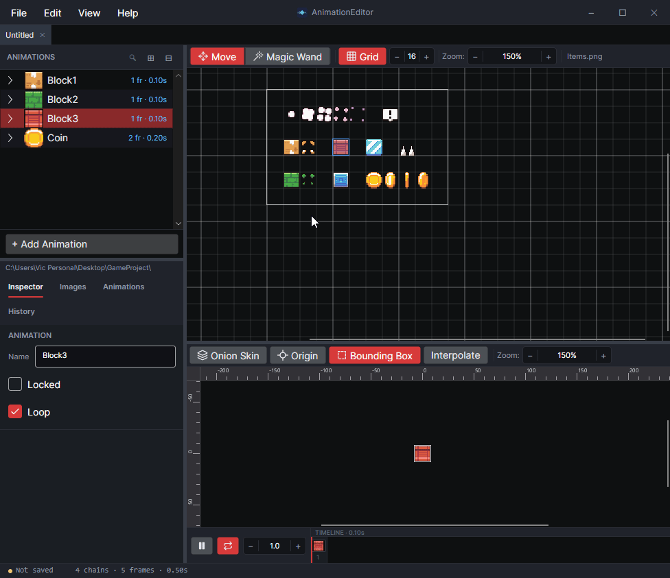<figcaption></figcaption></figure>

The **Duplicate** menu can also flip the copy with **Flip Horizontal** or **Flip Vertical**. When the name contains a direction, the copy's name is changed to match its new direction. For example, duplicating WalkRight with **Flip Horizontal** creates WalkLeft, and duplicating JumpUp with **Flip Vertical** creates JumpDown.

Alternatively, press **Ctrl+D** (**⌘D** on macOS) to duplicate the selected animation, or copy and paste it with **Ctrl+C** and **Ctrl+V** (**⌘C** and **⌘V** on macOS).

## Flip an Animation

To flip an animation, right-click the animation and select **Flip Horizontally** or **Flip Vertically**.

<figure>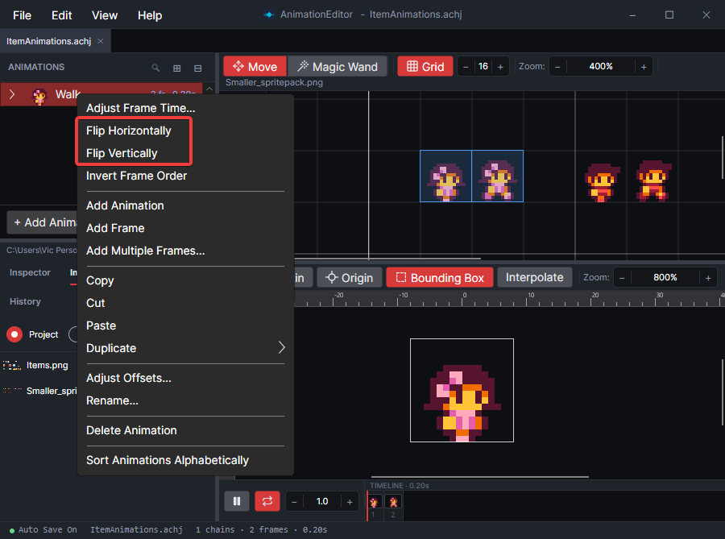<figcaption></figcaption></figure>

To flip individual frames instead, see [Flip a Frame](edit-frames.md#flip-a-frame).

Flipping isn't available in [Tiled `.tsx` projects](animate-a-tiled-tileset.md).

## Move All of an Animation's Frames

To move every frame's region on the image at once, see [Move All Frames at Once](choose-what-a-frame-shows.md#move-all-frames-at-once).

## Change an Animation's Speed

To change an animation's speed, right-click the animation and select **Adjust Frame Time…**.

<figure>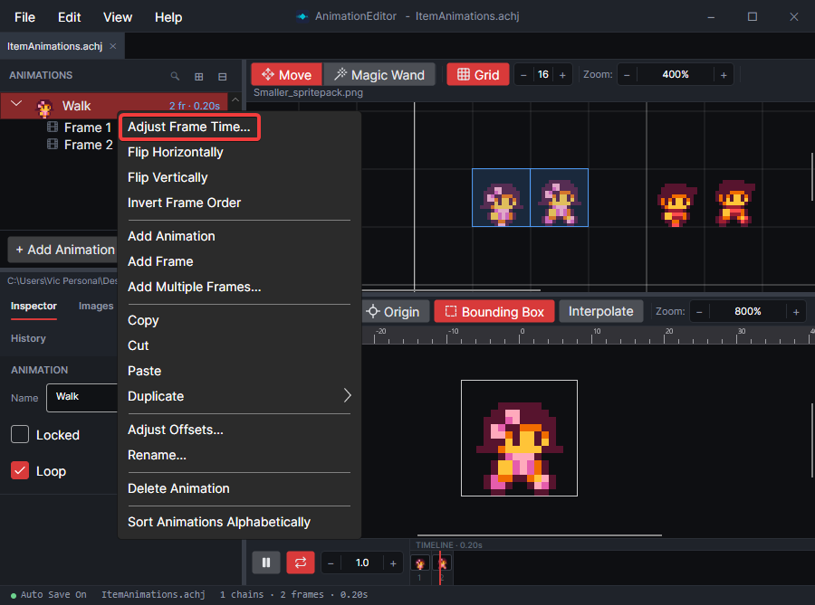<figcaption></figcaption></figure>

A popup appears where you can adjust the frame time. Changes apply to the playing animation right away. Click **OK** to keep the new time, or **Cancel** to undo the changes.

<figure>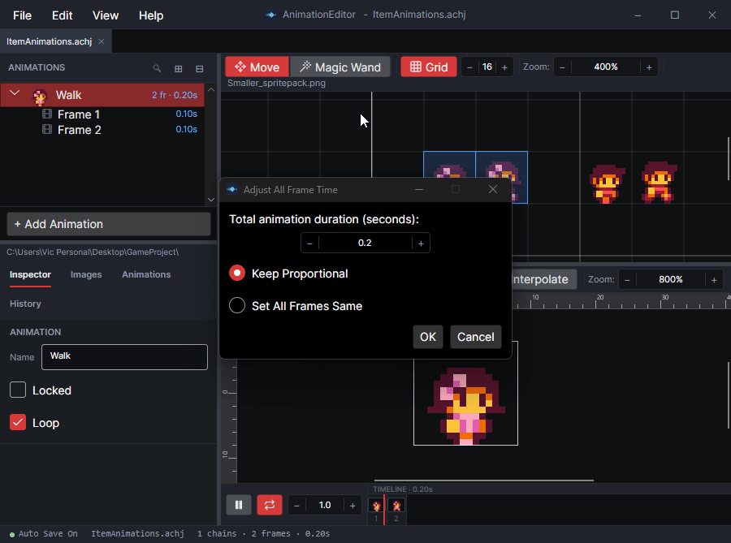<figcaption></figcaption></figure>

An animation's length isn't a property of the animation itself. It's the sum of its frames' times. To change individual frames instead, see [Change How Long a Frame Shows](edit-frames.md#change-how-long-a-frame-shows).

## Turn Looping On or Off

To turn looping on or off, click the **Loop** checkbox in the **Inspector** tab, or the loop button next to the timeline. Both control the same setting.

<figure>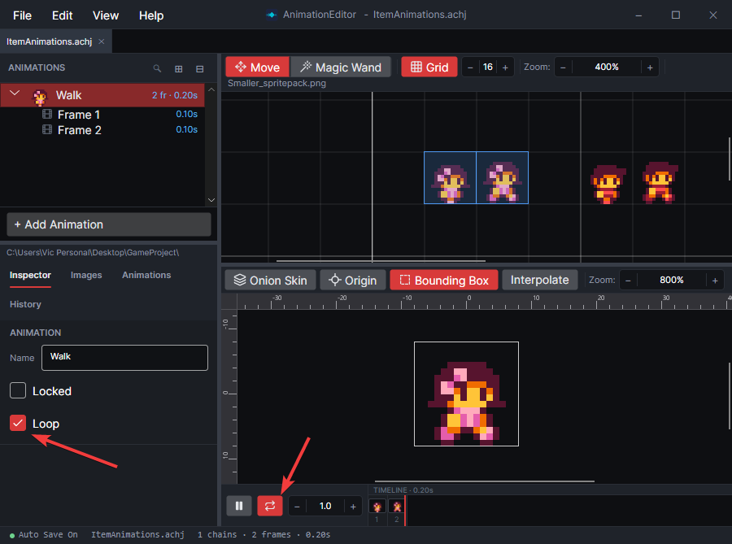<figcaption></figcaption></figure>

## Lock an Animation

Locked animations prevent accidental editing. To lock an animation, hover over the animation in the list and click the lock icon.

<figure>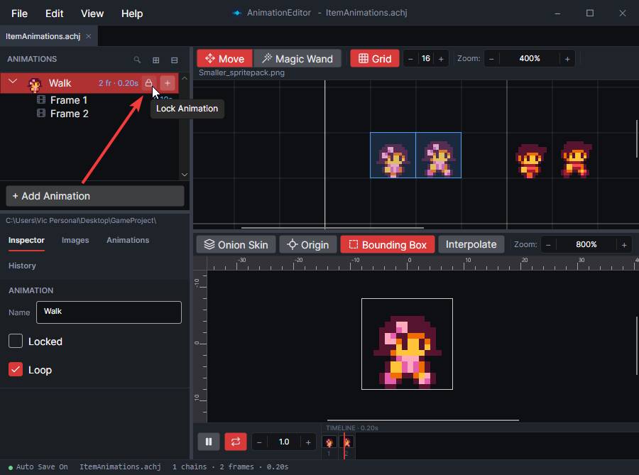<figcaption></figcaption></figure>

Alternatively, select the animation and check **Locked** in the **Inspector** tab.
