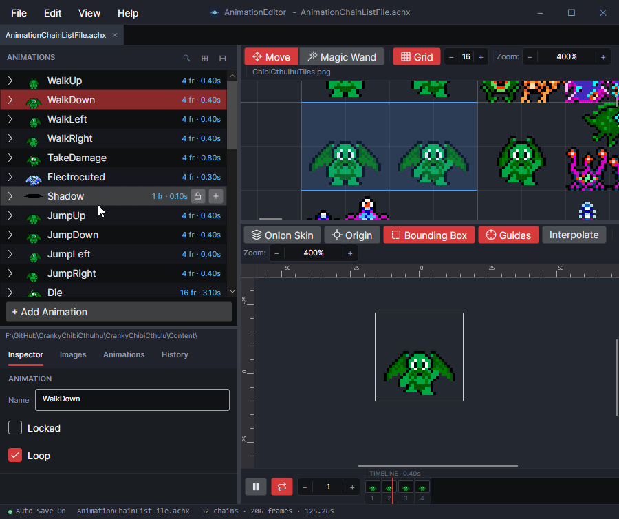

# Use Lock and Multi-Select

## Locking and Editing

Animations can be locked to prevent accidental editing.

<figure><figcaption>
Locked Animation
</figcaption></figure>

Locking animations can be combined with multi-selection so that editing can be performed while viewing multiple animations together.

### Offsetting Animation Frames

At times multiple animations must play together with stacked sprites. For example, a player animation may play on top of a shadow. Animations can be offset so that when stacked, the offsets position the sprites correctly. The following image shows a walking and shadow animation, multi-selected so they stack properly.

<figure><figcaption>
Shadow sprite under a walking animation - the background color is brighter so the shadow is easily visible
</figcaption></figure>

Consider a situation where the shadow animation needs to be adjusted. In this case, you may want to see the walking animation while performing the offset. To do this:

1. Multi-select the desired animation in the correct order - in this case, the shadow is selected first
2. Click the Lock icon to lock the walking animation
3. Move the shadow animation in the bottom window

<figure><figcaption>
Moving just one animation
</figcaption></figure>

### Mixing Animation and Frame Selection

When using multi-select, you can what is being viewed through the timeline. The example above modified the shadow of the walking character by moving its frame while the walking animation was playing. Perhaps you want to stop the animations to make sure that the shadow is positioned correctly on all frames.

Individual frames can be selected in the timeline. The multi-selection is preserved when clicking on timelines.

<figure><figcaption>
Selecting frames in multiselect can be used to compare one animation against the frames of another
</figcaption></figure>

This method can also be used to edit shapes relative to other frames of animation.

<figure><figcaption></figcaption></figure>
