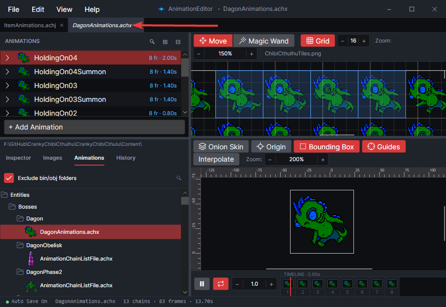
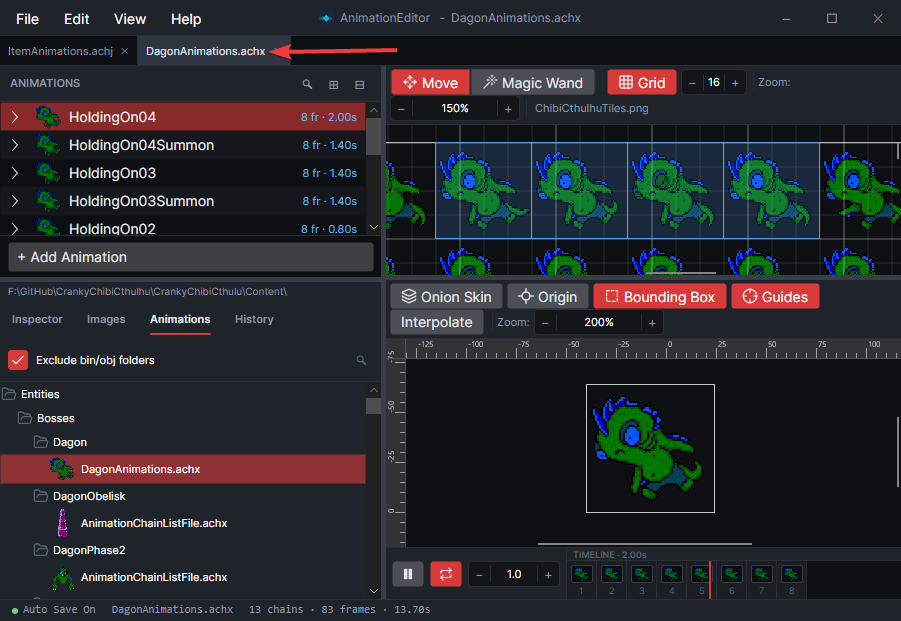
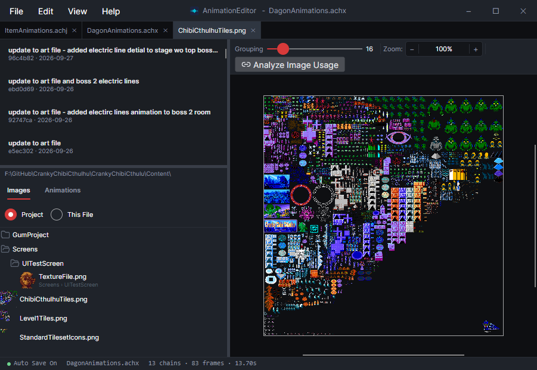
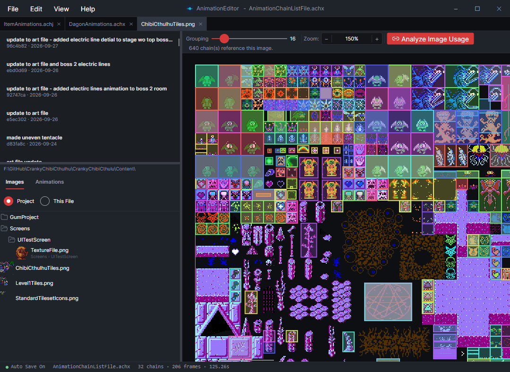
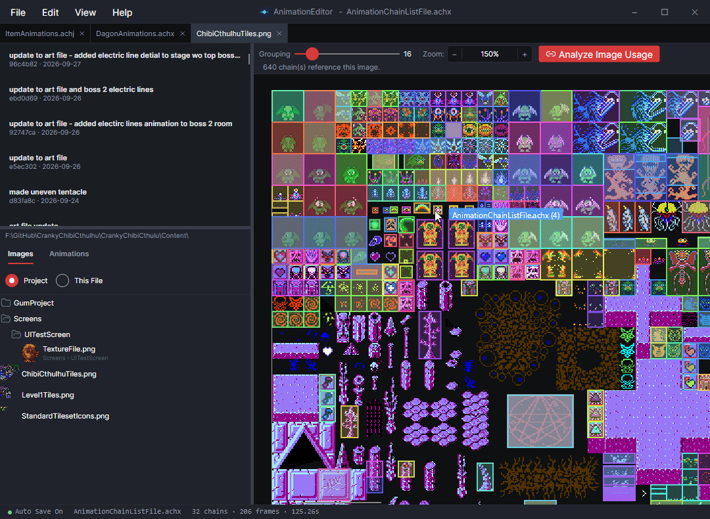

# Work with Project Folders

## Introduction

Project folders simplify the creation and management of animation files. This page shows how to work with project folders and outlines some of the benefits that project folders provide.

## Open and Close a Project Folder

To open a project folder, select **File ▸ Open Project Folder…** Once a project folder is opened, the AnimationEditor displays all animation and image files in their respective tabs. Note that the AnimationEditor lists `.achj`, `.achx`, and `.tsx` files.

The AnimationEditor remembers your previously-opened project folder and automatically selects it the next time it is launched.

## Find Files (Images and Animations Tabs)

The **Images** and **Animations** tabs both display the full folder structure of your project, including sub-folders. You can browse your project's files or search for specific files by clicking the **search** icon.

Both tabs display preview icons for each file. For `.png` files the entire image is displayed. For animations, the first frame of the first animation is displayed.

## Open, Switch, and Close Files

To open a file in the **Animations** tab, click the file. Its name is displayed in italics to indicate that it will be replaced on the next click.

<figure><figcaption></figcaption></figure>

If you want it to stay open, double-click the item in the **Animations** tab, or make an edit to the file.

<figure><figcaption></figcaption></figure>

To view an image file, double-click the image file. A double click is necessary so that single clicks do not accidentally open image files when attempting to [drag and drop an image on a frame](../quick-start.md).

<figure><figcaption></figcaption></figure>

## Add Animation Files to a Project

You can add new animation files by right-clicking on a project's folder and selecting **New Animation File**.

Any changes made on disk, such as copying an existing animation without using the AnimationEditor, are automatically reflected in the project tabs immediately.

## Find Which Animations Use an Image

If a project is open, you can track which portions of an image are used by animations in your project. To do this, open an image (double click it) to view it, then click **Analyze Image Usage**. Each animation is displayed in a different color.

<figure><figcaption></figcaption></figure>

Click on any frame to open the corresponding animation.

<figure><figcaption></figcaption></figure>
## Work Without a Project Folder
