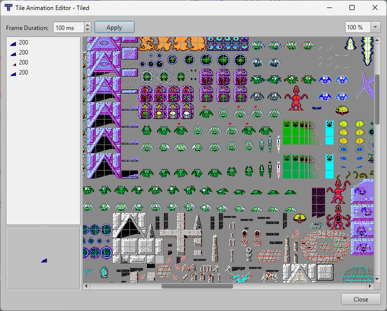
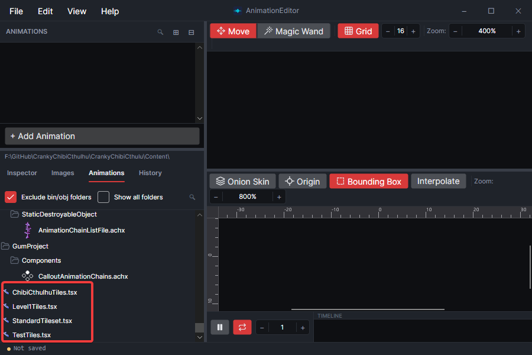
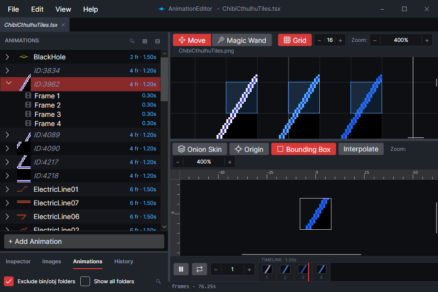
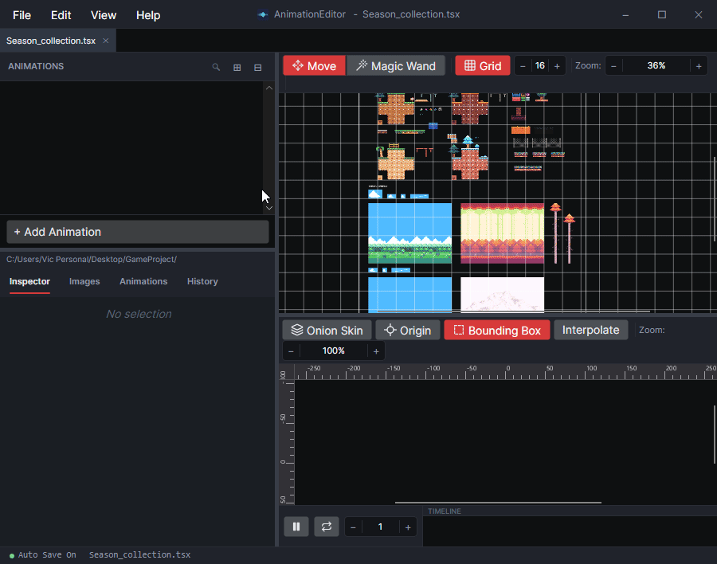
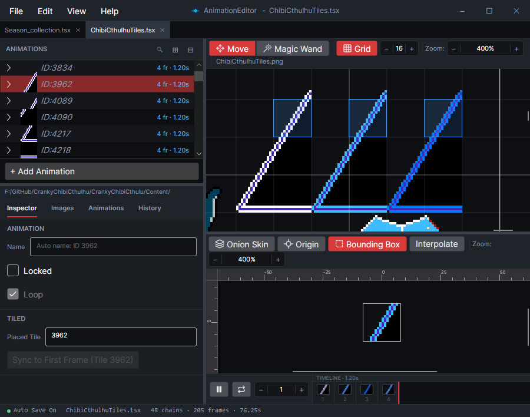
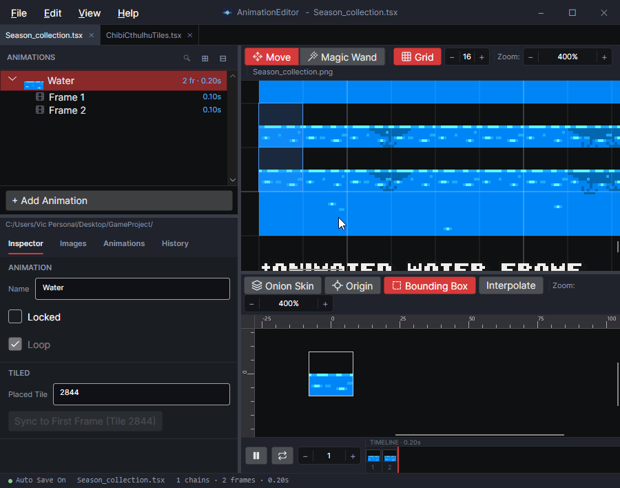

# Work with Tiled TileSets (.tsx)

### .TSX File Format

The [Tiled application](https://www.mapeditor.org/) supports animated tiles. Normally animated tiles are defined in the Tiled application using their built-in animation UI.

<figure><figcaption>
Tiled Animation Editor.
</figcaption></figure>

The same .TSX file can be loaded and edited using the AnimationEditor. Working with .TSX files in the AnimationEditor can be more convenient since it is built primarily to create and preview sprite and tile animations.

### Loading .TSX Files

.TSX files can be loaded as single files in the AnimationEditor, or as part of a project. If you are set up to view a project, then .TSX files automatically appear in the list of files.

<figure><figcaption>
.TSX files listed in the Animations project tab
</figcaption></figure>

Once a .TSX is loaded, its animations appear in the Animations list, and the tileset's image appears in the preview window.

<figure><figcaption></figcaption></figure>

Of course, if your .TSX file has no animations, then the Animations list will be empty.

## Creating New Animations

Creating animations in a .TSX file is the same as creating animations in a regular .ACHJ file. After you have a .TSX file open:

1. Click the Add Animation button
2. Enter a name for the new animation
3. CTRL+click on your tileset to add a new frame to the animation

<figure><figcaption>
Adding an animation in a .TSX
</figcaption></figure>


The .TSX file format does not support empty animations. Any animation without at least one frame will be lost when the AnimationEditor is closed.


### Animation Names

The AnimationEditor requires animations to have a name when they are created. This is not a requirement in the .TSX file format. Animations created through Tiled may not have names, and will instead appear as unnamed animations, instead displaying the ID of the tile that owns the animation.

<figure><figcaption></figcaption></figure>

Unnamed animations can be given a name to help you organize your project, but they are not required. Similarly, you can delete an animation's name to have it fall back to displaying its ID.

### Multi-Tile Animations

The AnimationEditor greatly simplifies the creation of animations that span multiple tiles. Normally if you want to create an animation that spans multiple tiles, you must create one animation per tile.

Rather than managing multiple animations, the AnimationEditor lets you create a single animation which spans multiple tiles.

Once you have created an animation that references one of the tiles in a multi-tile animation, you can resize one of the frames so it spans any number of tiles. Doing this updates all frames in the animation, enforcing the rule that every frame must be the same size for Tiled animations.

<figure><figcaption>
Animations spanning multiple tiles
</figcaption></figure>


Internally, the .TSX file is saved with multpile animated tiles, but they are grouped together through a parent ID so they appear as a single animation in the AnimationEditor. This is done purely for convenience and has no impact on the .TSX in Tiled or at runtime.


### .TSX Animation Limitations

Since the AnimationEditor works with the raw .TSX file format, it inherits all of its animation limitations. These limitations are:

* Flipping Frames - flipping must be done on the Tiled map rather than in the animation itself
* Color and Alpha - animations frames cannot set color operations, color, or alpha values
* Shapes - frames cannot contain shapes&#x20;
* Multiple animations per tile - each tile can own a single animation
* Offsets - frames cannot apply X or Y offsets
* Arbitrary position and size - animations must be grid-aligned

These limitations are enforced by the AnimationEditor, so you may notice that editing animations in a .tsx file looks different than editing animations in .achj files
