# Quick Start

## Introduction

The AnimationEditor can work with single files, or it can help you manage a project which may use multiple animation files. This quick start shows how to work with projects since it simplifies finding and using existing PNG files.

This guide assumes that you have an existing folder with one or more images.

Before you open the project, the AnimationEditor shows an empty animation list.

<figure>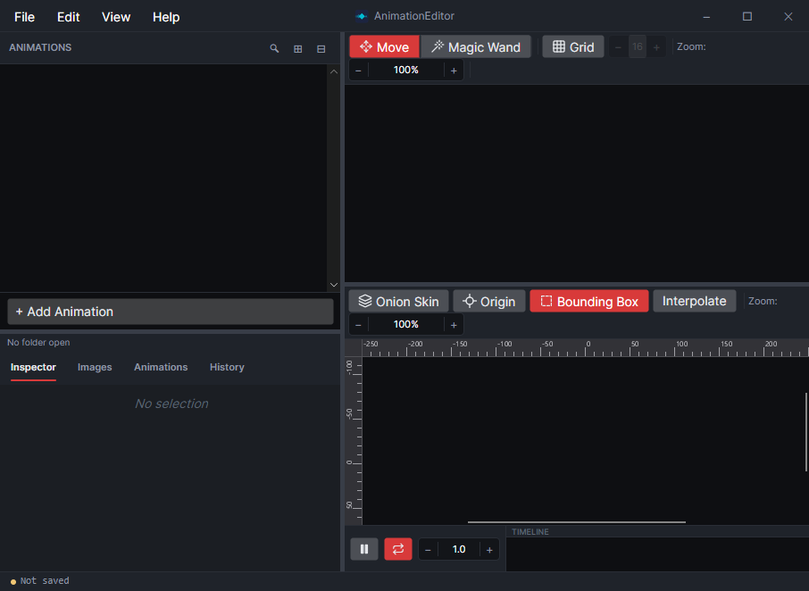<figcaption></figcaption></figure>

## Open a project Folder

To open a project folder, select File->Open Project Folder...

<figure>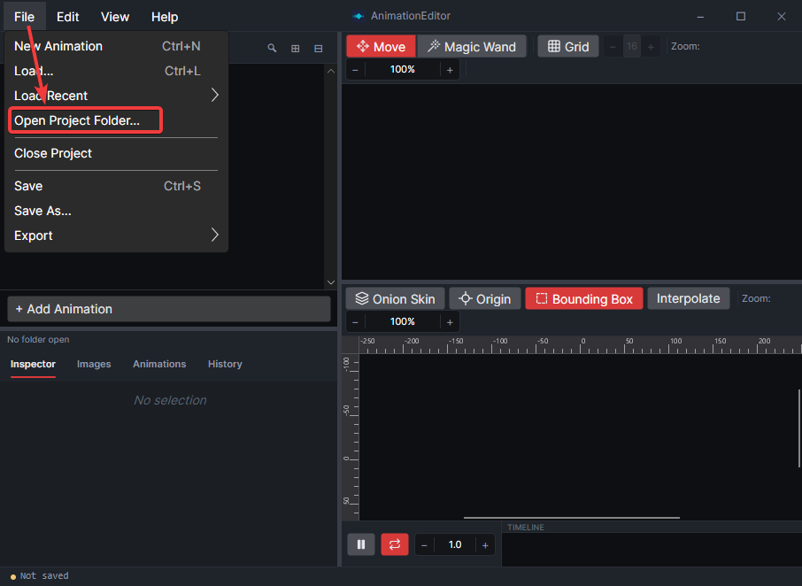<figcaption></figcaption></figure>

Once a project folder is opened, all images in the project apear in the Images tab. Any existing animations also appear in the Animations tab.

<figure>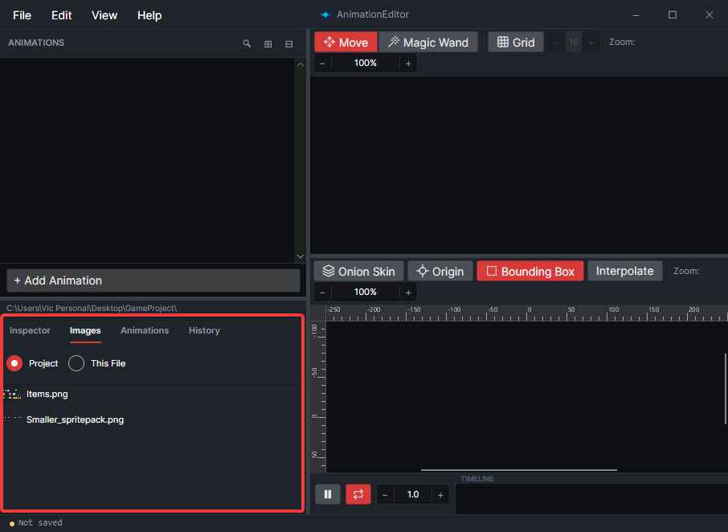<figcaption></figcaption></figure>

## Add an Animation

Click the Add Animation button to add a new animation.

<figure>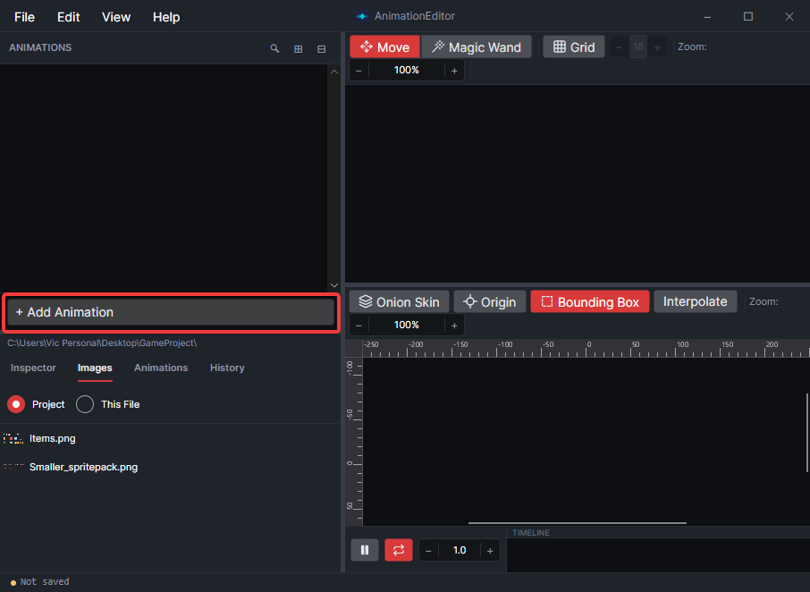<figcaption></figcaption></figure>

Give the animation a name - it now displays as an empty animation.

<figure>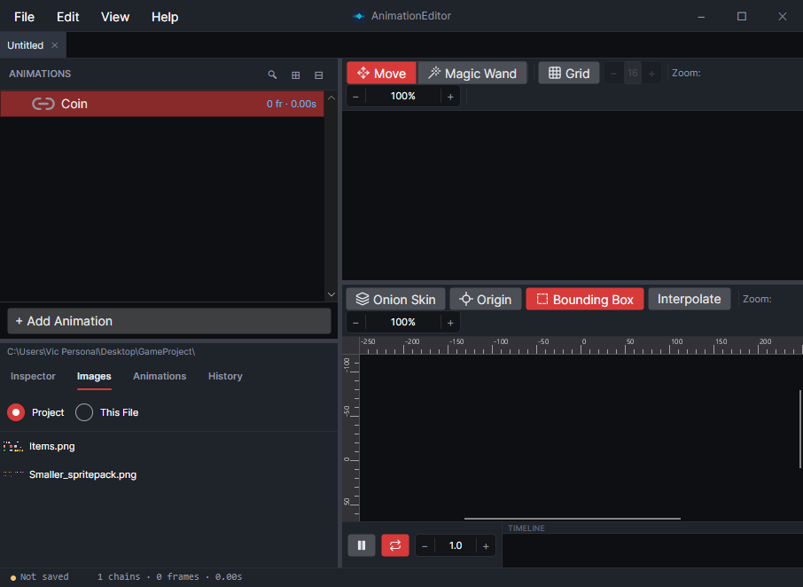<figcaption></figcaption></figure>

You can add frames by hovering over the animation and pressing the + button.

<figure>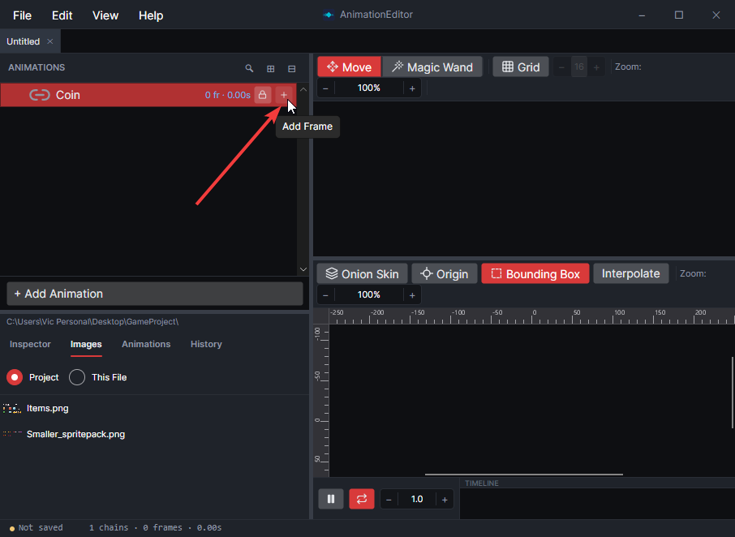<figcaption></figcaption></figure>

Drag+drop the desired image on the new frame to use the image on the animation frame.

<figure>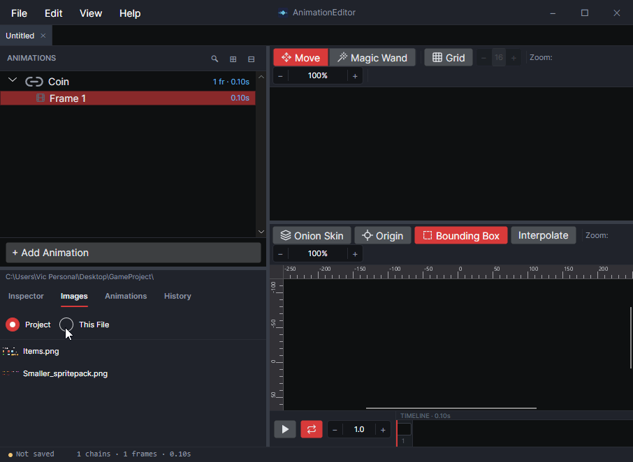<figcaption></figcaption></figure>

## Editing Frames

To edit a frame, drag the handles or the body of the frame in the editor window. Clicking the Grid option makes it easier to work with sprite sheets which are grid-aligned.

<figure>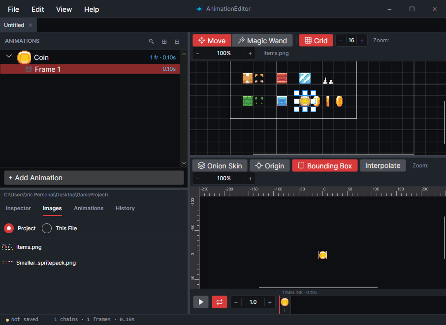<figcaption></figcaption></figure>

## Creating Multiple Frames

To add more frames, either press the + button, or use the copy/paste commands (such as CTRL+C, CTRL+V) to add more frames.

<figure>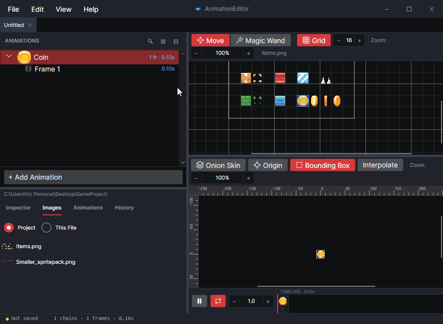<figcaption></figcaption></figure>

Frames can be moved by dragging the frame. The mouse wheel or touchpad can be used to zoom in closer to make it easier to work with frames.

<figure>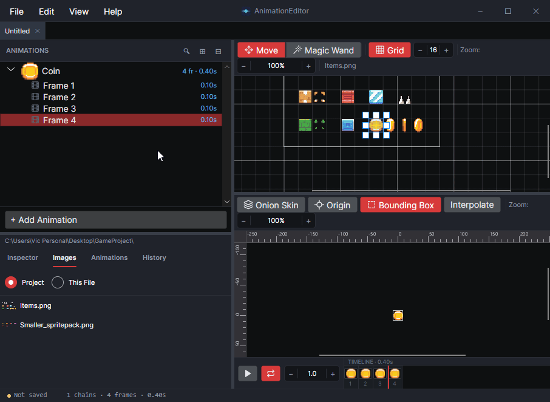<figcaption></figcaption></figure>

## Watch It Play

Select an entire animation to see it preview in the preview tab.

<figure>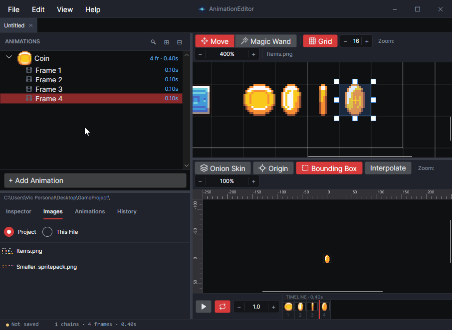<figcaption></figcaption></figure>

## Save

Files must be initially saved by clicking File->Save. These files should be saved in your game's project, such as in the same folder as your .png image files.

Once a file is saved, the AnimationEditor automatically saves any changes.

<figure>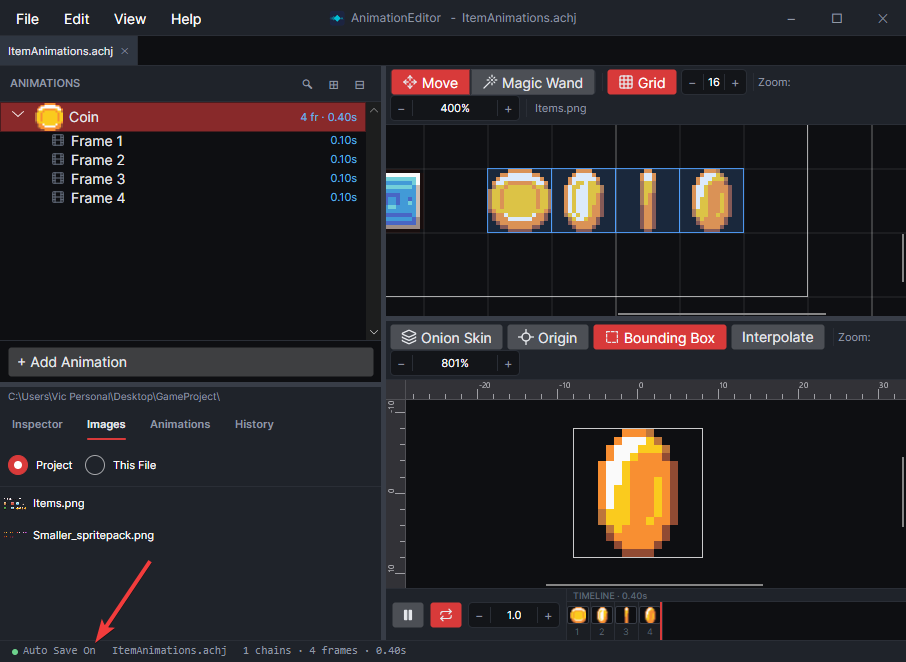<figcaption></figcaption></figure>