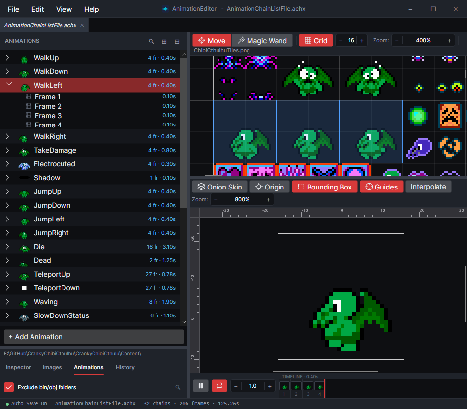
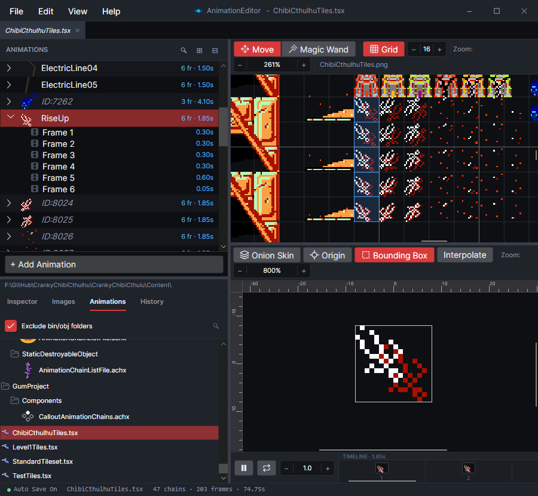

# AnimationEditor

## What Is the AnimationEditor

The AnimationEditor is a cross-platform app for creating and managing animation files for your game project. Animations are a list of **frames**, where each frame references a source image and indicates which portion of the image to display. Frames can reference an entire image or a portion of an image, as is common when working with sprite sheets and tile maps.

<figure><figcaption>
AnimationEditor displaying a WalkLeft animation
</figcaption></figure>

## Supported Files

The AnimationEditor natively works with the .achj file format (*AnimationChain JSON*). Alternatively, the AnimationEditor can also work with .achx files (*AnimationChain XML*).

These files can be loaded at runtime using [NuGet packages](api/reading-raw-animation-data.md) for custom rendering. Some runtimes, such as [MonoGame](api/loading-and-drawing-achx-animations.md), also have dedicated NuGet packages which simplify rendering of animations.

The AnimationEditor also works with [Tiled's](https://www.mapeditor.org/) .tsx file format, simplifying the process of creating animated tiles.

<figure><figcaption>
AnimationEditor displaying animations in a .tsx file
</figcaption></figure>

## Opening Files from Windows

The Windows installer registers the AnimationEditor for .achj and .achx files, so double-clicking either type opens it. Uninstalling removes that registration and leaves other apps' associations alone.

If you previously chose another app for these files, Windows keeps that choice. To switch, right-click a file, select **Open with ▸ Choose another app**, pick **AnimationEditor**, and check **Always**.

The portable build doesn't register anything. To open files with it, use **Open with ▸ Choose another app**, then browse to `AnimationEditor.exe`.

## Where to Go Next

To get the editor running, see [Install](install.md). If you'd like to jump in, check out the [Quick Start](quick-start.md) guide, or the [How-To Guides](how-to/README.md).