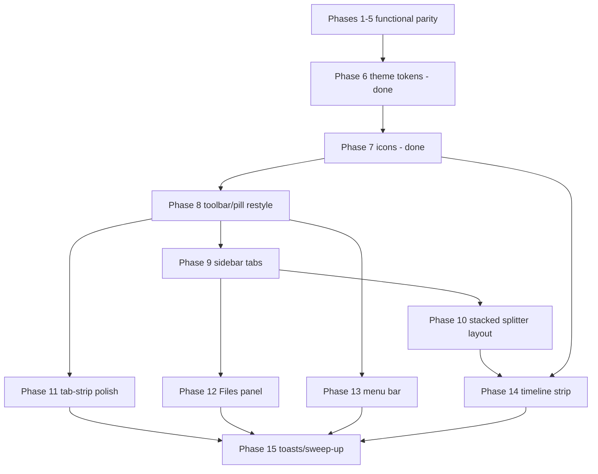

# Animation Editor browser — UI/UX design-parity roadmap (Phases 6–15)

**Status:** Living document, reconciled against the original plan
(`ok-whats-next-what-golden-shore.md`, authored during Phase 6 planning). An earlier version of
this file was reconstructed from issue/PR text because the original hadn't been committed to git;
that reconstruction got Phases 8–9 right but drifted from Phase 9 onward (wrong Files-panel timing,
wrong phase ordering for menu bar/toasts/status bar/timeline). This version is copied from the
original source, not re-inferred.

**Goal:** Bring `AnimationEditor.Browser` to **~95% visual/UX parity** with desktop
`AnimationEditor.App/MainWindow.axaml` — same palette, spacing, iconography, layout chrome, and
feedback patterns — without re-implementing desktop-only OS integration (window drag/resize/
minimize-maximize-close controls, native macOS menu bar, etc.).

This roadmap is **separate from** the earlier **functional-parity** pass (Phases 1–5, post-#588),
which wired editing features into the browser build. Phases 6–15 assume that functional baseline
exists and focus on *looking and feeling* like the desktop app.

---

## How to use this doc

| When… | Read… |
|---|---|
| Starting any Phase 6–15 issue | This file for scope + ordering |
| Implementing a phase | The phase's GitHub issue body (if filed) **and** ship a `docs/BROWSER_*_DECISION.md` on merge |
| Picking up mid-roadmap | The latest merged decision doc + grep `Phase N` in `AnimationEditor.Browser/` |

**Issue linkage:** #630 (Phase 6), #644 (Phase 7), #648 (Phase 8), #649 (Phase 9), #652 (Phase 10),
#654 (Phase 11), #655 (Phase 12). Phases 13–15 issues are **not filed yet** — file
each from its own worktree when that phase starts, per the convention below.

**Process, same convention as Phases 1–5:** each phase = its own GitHub issue + its own
`.claude/worktrees/<NNN-name>` branched from the previous phase's merged tip + a
`docs/BROWSER_<NAME>_DECISION.md` on merge + TDD wherever the change touches
`AnimationEditor.Core`/`.Views` (browser-only `App.axaml.cs` wiring stays untested glue, per
established convention) + full `dotnet build` + all 3 test suites green + live-Chrome verification
before merging.

---

## Prior work: functional parity (Phases 1–5)

These shipped before the design-parity pass. Listed here so later phases aren't confused with
"first time we add tabs/undo/etc."

| Phase | Issue | Scope (summary) | Decision doc |
|---|---|---|---|
| 1 | #603 | Read-only `AnimationTreeControl` + `InspectorControl` | `BROWSER_TREE_INSPECTOR_DECISION.md` |
| 2 | #610 | Mutation, Undo/Redo, history panel, editable inspector, theme `localStorage` | `BROWSER_SETTINGS_DECISION.md` |
| 3 | #614 | `WireframeControl` canvas editing (move + magic wand) | `BROWSER_WIREFRAME_DECISION.md` |
| 4 | #620 | Multi-file `TabManager` tabs + Files panel wiring | `BROWSER_TABS_DECISION.md` |
| 5 | #622 | PixiJS blob export, onion skin, guides, interpolate, F3 diagnostics, zoom/grid UI | `BROWSER_EXPORT_POLISH_DECISION.md` |

**Browser build shape after Phase 5:** `AnimationEditor.Browser/App.axaml.cs` built the entire UI in
raw C# — plain `Button`/`ToggleButton`/`StackPanel` toolbars, a fixed 3-column grid (tree |
wireframe | preview), no `DynamicResource` styling, no SVG icons, no splitters, no menus, no toast
overlay, a single-line status `TextBlock`.

---

## Context (from the original plan)

Every phase 1-5 built its own UI in raw C# using plain unstyled `Button`/`CheckBox`/`ToggleButton`
controls — no theme, no icons, no menu, a fixed 3-column layout, tree+inspector+history all
permanently stacked in one narrow column. The user asked for a design pass to bring the browser
build to ~95% UI/UX parity with desktop (not pixel-perfect, but the same look, layout, and
interaction model), comparing the two directly.

Desktop's real structure was mapped by reading `MainWindow.axaml`/`.axaml.cs` directly, not
guessed — see "Desktop UI reference" below.

### Resolved decisions

1. **Custom window chrome**: adapt the *visual style* only (branded header bar: icon, app name,
   active filename) — do **not** attempt drag-to-move / custom resize / custom
   minimize-maximize-close. The browser tab already has real OS chrome for those; a page fighting
   it is user-hostile.
2. **Canvas layout**: match desktop — Wireframe stacked over Preview with a draggable
   `GridSplitter`, replacing the current fixed side-by-side two-column layout.
3. **Menu bar**: recreate File/Edit/View/Help for visual/discoverability parity, but drop or remap
   any keyboard shortcut the browser itself reserves (see the shortcut table in Phase 13).
4. **Scope**: full — includes building the timeline/scrubber strip and a Files panel, both 100%
   absent from the browser today, not just visual/theming/layout polish of what already exists.

### Desktop UI reference (verified from `MainWindow.axaml`/`.axaml.cs`)

- **Layout**: chromeless window, custom title bar (36px: icon/name/filename/Menu/drag
  region/min-max-close) → multi-file tab bar (30px, code-behind-built, drag-to-reorder + context
  menu) → status bar (bottom, 22px, 3 zones: save-state dot+filename+counts | cursor+selection |
  transient toast) → main grid `ColumnDefinitions="300,4,*"` = [sidebar, resizable] | [splitter] |
  [wireframe/preview].
- **Sidebar** (`RowDefinitions="2*,4,3*"`): row 0 = always-visible ANIMATIONS tree (search toggle,
  Expand/Collapse-All) — row 1 = splitter — row 2 = `TabControl` (`SidebarTabs`) with **Inspector**
  (default), **Files** (`FilesPanelControl`), **History** tabs — a real tab control, only one panel
  visible at a time.
- **Right side** (`RowDefinitions="Auto,*,4,250"`): wireframe toolbar → wireframe canvas → splitter
  → preview block (toolbar → canvas → 52px timeline strip). Timeline strip is an inline
  `ItemsControl` in `MainWindow.axaml` (not a portable class) but its geometry math —
  `AnimationEditor.Core/ViewModels/TimelineBuilder.cs` (frame-to-pixel-width) and
  `TimelineScrubMapper.cs` (pixel-to-frame hit-testing) — is already pure, portable, and fully
  unit-tested.
- **Toolbars**: `WrapPanel`s (overflow reflows, doesn't clip). Wireframe = Move/MagicWand pill +
  Grid toggle+stepper + Zoom stepper. Preview = Onion Skin / Guides / Interpolate toggles + Zoom
  stepper. All zoom/grid/speed steppers are the SAME control:
  `AnimationEditor.Views/Controls/ZoomControl.axaml(.cs)` — already exists, already shared, already
  theme-token-driven (`Attach(IZoomTarget target)`, uses `{DynamicResource LineBrush}` etc.
  throughout its XAML). Zoom pills are not copy-pasted markup — they're one reusable class already.
- **Menu bar**: File (New/Load/Save/Save As/Export→PixiJS), Edit (Undo/Redo/Copy/Cut/Paste/
  Duplicate/Reload/Hot-Reload-toggle/Resize-Texture/Settings), View (Wireframe/Preview zoom
  in/out, Show History, Theme submenu), Help (Show Render Diagnostics F3, View Log, About).
- **Inspector**: sectioned (`SectionName` 11px SemiBold uppercase headers) — Frame:
  COORDINATES/TIMING/TRANSFORM(+flip icon toggles)/TEXTURE/COLOR; Rect: Name/X/Y/ScaleX/ScaleY;
  Circle: Name/X/Y/Radius.
- **FilesPanelControl** (`AnimationEditor.App/Controls/`, desktop-only): PNG tree with a
  **Project / This File** scope toggle (added post-Phase-5, issue #615) — "This File" filters to
  just the open `.achx`'s referenced textures via
  `AnimationEditor.Core/Data/TextureListBuilder.GetAvailableTextures(AnimationChainListSave?)`, a
  pure, portable, disk-free function. "Project" scans the whole browse-root folder
  (`PngFolderScanner`, real disk walk, not portable). `FilesPanelControl` itself requires a real
  `Window` and disk folder scan — not portable as a class.
- **Theming**: `App.axaml`'s `ResourceDictionary.ThemeDictionaries` (Dark/Light — `BgCanvas`,
  `LineBrush`, `Ink`/`InkMid`/`InkDim`, `Accent`/`AccentSoft`/`AccentCool`/`Ok`, icon-color
  tokens), consumed via `DynamicResource` everywhere. Separate
  `AnimationEditor.Views.Theming.CanvasPalette` (SkiaSharp colors for the hand-drawn canvases) is
  already shared and already used by the browser build.
- **Context menus / affordances**: per-node-type tree right-click menu (huge, ~15 distinct items
  depending on node type), tab-strip context menu (Detach to New Window / Close Tab), title-bar
  filename menu (Open Containing Folder / Copy Full Path), hover-reveal add-frame button, inline
  double-click rename (already ported to browser in Phase 2), toasts (undo, generic, error banner).

---

## Design-parity pass (Phases 6–15)

Prerequisite chain: **6 → 7 → 8+**. Phase 6's theme tokens and Phase 7's icon system must land
before toolbar/sidebar work can look correct.

### Phase 6 — Shared theme-token foundation ✅

| | |
|---|---|
| **Issue** | #630 (merged #631) |
| **Status** | **Done** on `main` |
| **Doc** | `BROWSER_THEME_TOKENS_DECISION.md` |

**Scope:** Extract `App.axaml`'s `ThemeDictionaries` (Dark/Light brush/color tokens) plus the style
classes (`.compact`, `.flanker`, disabled-button opacity) out of `AnimationEditor.App/App.axaml`
into `AnimationEditor.Views/Theming/ThemeTokens.axaml` + `ThemeStyles.axaml`; merge into both
`App.axaml`s via `ResourceInclude`/`StyleInclude`.

**Explicitly deferred:** the icon-dependent `ButtonSpinner` `ControlTheme` override and
`.plus`/`.minus` classes → Phase 7 (they need icons that didn't exist in the browser yet).

**Intentionally invisible in browser** until Phase 8 — nothing consumed `DynamicResource` keys yet
except `ZoomControl` (not used in the browser build until Phase 8).

---

### Phase 7 — Icon system spike + rollout ✅

| | |
|---|---|
| **Issue** | #644 |
| **Status** | **Done** — spike passed, rollout implemented, PR pending from `644-ae-web-icons` |
| **Doc** | `BROWSER_ICON_SYSTEM_DECISION.md` |

**Scope:**

1. **Spike:** Add `Svg.Controls.Skia.Avalonia` to `AnimationEditor.Browser`; render one SVG in a
   live Chrome tab; confirm `dotnet publish -c Release` for `net10.0-browser` succeeds and the icon
   still renders. This package's WASM-asset behavior was unverified going in (SkiaSharp itself
   works on WASM; that doesn't guarantee this NuGet package's asset pipeline does).
2. **Rollout (spike passed):** Moved all 23 SVGs from `AnimationEditor.App/Assets/icons/svg/` to
   `AnimationEditor.Views/Assets/icons/svg/`; added the package to `AnimationEditor.Views` +
   `AnimationEditor.Browser`; rewrote every `avares://AnimationEditor/.../svg/` icon URI repo-wide
   to `avares://AnimationEditor.Views/...` (no back-compat shim — prerelease).
3. Moved Phase 6's icon-dependent deferrals into Views: `ThemeIconResources.axaml`
   (`ButtonSpinner` `ControlTheme`) and the `.plus`/`.minus` classes in `ThemeStyles.axaml`.
4. **Found along the way (unrelated to icons):** `dotnet publish -c Release` was already broken on
   `main` before any Phase 7 work — `XmlFile.Deserialize` (XmlSerializer) and
   `AnimationTreeControl.axaml`'s `ReflectionBinding` both trigger `IL2026` trim-analysis errors
   that promote to a fatal `NETSDK1144`. Fixed narrowly (`NoWarn` `IL2026` only, plus
   `TrimmerRootAssembly` for the SVG package specifically) rather than disabling
   `PublishTrimmed`, to preserve the bundle-size discipline M4 established.

**Fallback that was NOT needed:** inlining icons as Avalonia `<Path Data="...">` — the SVG path
was viable, so this wasn't used.

---

### Phase 8 — Toolbar/pill restyling + branded header bar ✅

| | |
|---|---|
| **Issue** | #648 |
| **Status** | **Done** — merged into `644-ae-web-icons` (same branch/PR as Phase 7, per no-stacked-PRs directive) |
| **Doc** | `BROWSER_TOOLBAR_RESTYLE_DECISION.md` |
| **Depends on** | Phase 6 ✅, Phase 7 ✅ |

**Scope:** Restyle existing edit/view toolbars into `WrapPanel`s with pill borders using Phase 6's
tokens; replace the bespoke +/- zoom-stepper buttons with real `ZoomControl` instances
(`.Attach(wireframe)`/`.Attach(preview)`) — a net simplification, deletes custom stepper code in
favor of the already-tested shared control. Add the branded header bar (visual only, per decision
#1 above — icon, app name, active filename; **no** drag-to-move/custom resize/minimize-maximize-
close) above the tab strip. Restyle the status-bar-equivalent text toward desktop's 3-zone layout,
scoped to data the browser build actually has (no fake dirty-tracking).

**Verification:** theme toggle must actually change toolbar colors, not just canvas.

---

### Phase 9 — Tabbed sidebar (Inspector/History) + sectioned Inspector ✅

| | |
|---|---|
| **Issue** | #649 |
| **Status** | **Done** — merged into `644-ae-web-icons` (same branch/PR as Phases 7-8) |
| **Doc** | `BROWSER_SIDEBAR_TABS_DECISION.md` |
| **Depends on** | Phase 8 ✅ (styled chrome for tab headers) |

**Scope:** Replace the fixed tree+inspector `Grid` with desktop's shape: tree always visible (top)
+ `GridSplitter` + `TabControl` below with **Inspector** (default) and **History** tabs.

**Files tab is explicitly deferred to Phase 12** — don't let its port-vs-rebuild research block
this phase (same precedent `BROWSER_TABS_DECISION.md` already set once for a different feature).

Move Phase 5's always-visible History panel into the History tab verbatim. Restyle
`InspectorControl.axaml` with sectioned headers (COORDINATES/TIMING/etc.) — this file is shared
with desktop, so verify desktop still renders correctly after the edit. TDD-applicable (shared
`Views` control): extend `InspectorControlTests.cs` before restructuring.

---

### Phase 10 — Splitter-based stacked canvas layout ✅

| | |
|---|---|
| **Issue** | #652 |
| **Status** | **Done** — merged into `644-ae-web-icons` (same branch/PR as Phases 7-9) |
| **Doc** | `BROWSER_SPLITTER_LAYOUT_DECISION.md` |
| **Depends on** | Phase 9 ✅ |

**Scope:** Replace the 3-column `Grid` with sidebar | splitter | [wireframe / splitter / preview]
**stacked** (Wireframe over Preview), per decision #2 above — replacing the current fixed
side-by-side two-column layout. Verify `WireframeControl`/`PreviewControl`'s pan/zoom math
(bounds-relative, not fixed-aspect) is unaffected by the layout change — a real behavior surface to
check, not just a container reflow. Browser-only wiring, no Core/Views changes expected.

---

### Phase 11 — Tab-strip visual polish + context menus ✅

| | |
|---|---|
| **Issue** | #654 |
| **Status** | **Done** — merged into `644-ae-web-icons` (same branch/PR as Phases 7-10) |
| **Doc** | `BROWSER_TABSTRIP_CONTEXT_MENU_DECISION.md` |
| **Depends on** | Independent of 12/14; reorderable |

**Scope:** Restyle the multi-file tab strip to desktop's `Border`-based active/inactive look with a
close button. Add the tab context menu, remapping "Detach to New Window" (no browser equivalent) to
something sane — recommend "Open in New Browser Tab" (`window.open()` to the same URL, a fresh
instance, not true state transfer) or drop it for a first cut. Drop "Open Containing Folder" from
the filename context menu (no filesystem); "Copy Full Path" is low-value against a synthetic path
but harmless to keep.

**Open judgment call:** whether a new tab opened via "Open in New Browser Tab" should share
`localStorage` theme state or start fully fresh — a product call, not resolved here.

---

### Phase 12 — Files panel (rebuild, not port; scoped to the active tab's referenced textures) ✅

| | |
|---|---|
| **Issue** | #655 |
| **Status** | **Done** — merged into `644-ae-web-icons` (same branch/PR as Phases 7-11) |
| **Doc** | `BROWSER_FILES_PANEL_DECISION.md` |
| **Depends on** | Phase 9 ✅ |

**Scope:** `FilesPanelControl` needs a real `Window` and a real disk folder scan — neither survives
the browser, so the port-vs-rebuild call goes to **rebuild** (same reasoning
`BROWSER_TREE_INSPECTOR_DECISION.md` used for tree/inspector in Phase 1). Model it on desktop's
**"This File"** scope specifically, not a cumulative session-wide dump:
`TextureListBuilder.GetAvailableTextures(projectManager.AnimationChainListSave)` already returns
exactly the active tab's referenced texture names, purely, with zero disk access and zero new Core
code needed — pair with `ThumbnailService.GetBitmap`/`GetFullImageThumbnail` for thumbnails. This is
cleaner than a flat `ThumbnailService.BitmapCache` dump (which would be session-cumulative and
drift from what "the current file" means once several tabs are open) and naturally updates
correctly on tab switch since `AnimationChainListSave` is already tab-scoped. New
`AnimationEditor.Views/Controls/FilesPanelControl` (browser-appropriate name TBD), wired as the
third sidebar tab. TDD-applicable (new Views control): test that it lists exactly the active tab's
referenced textures and updates on selection change, before writing the control.

**This phase is placed here only because the user's scope explicitly wants it** — nothing else
depends on it; it could move later without side effects.

---

### Phase 13 — Menu bar (File/Edit/View/Help) ✅

| | |
|---|---|
| **Issue** | #662 |
| **Status** | **Done** — merged into `644-ae-web-icons` (same branch/PR as Phases 7-12) |
| **Doc** | `BROWSER_MENU_BAR_DECISION.md` |
| **Depends on** | Independent of 12/14; reorderable |

**Scope:** Recreate the four menus, delegating to commands already wired via toolbar buttons
(Phases 2/5/8) — mostly wiring, not new logic.

**Keyboard-shortcut research** (browser-reserved shortcuts genuinely block or fight page-level
handlers — Chrome-verified only, spot-check Firefox/Safari before calling it final):

| Desktop shortcut | Browser-reserved? | Plan |
|---|---|---|
| Ctrl+N (New) | Yes — opens a new browser window, unpreventable | Drop accelerator, menu-only |
| Ctrl+L (Load) | Yes — focuses address bar | Drop accelerator, menu-only |
| Ctrl+S (Save) | Interceptable via `preventDefault` | Keep, wire `TopLevel.KeyDown` + `e.Handled = true`, same pattern as Phase 5's F3 |
| Ctrl+Z/Ctrl+Y (Undo/Redo) | Not reserved | Keep as-is |
| Ctrl+C/X/V (Copy/Cut/Paste) | Not reserved, subject to clipboard permission prompt | Keep as-is |
| Ctrl+D (Duplicate) | Yes — bookmarks page, hardened against `preventDefault` in some Chrome versions | Remap to Ctrl+Shift+D or drop accelerator |
| Ctrl+/Ctrl− (Wireframe zoom) | Yes — browser page-zoom, hard to suppress | Remap to `[`/`]` or unmodified `+`/`-` with canvas focus |
| Ctrl+Shift+/Ctrl+Shift− (Preview zoom) | Same page-zoom family | Remap similarly, e.g. `Shift+[`/`Shift+]` |
| F3 (Diagnostics) | Chrome default = page find | Keep existing Phase 5 best-effort handler |

---

### Phase 14 — Timeline/scrubber strip, full fidelity

| | |
|---|---|
| **Issue** | *(not filed — create `<issue#>-ae-web-timeline)* |
| **Depends on** | Phase 7 (icons), Phase 10 (soft — natural home is under a vertically-stacked preview panel) |

**Scope:** `TimelineBuilder`/`TimelineScrubMapper` (frame-width computation, scrub-position-to-frame
hit-testing) are already portable and fully tested — build the real thing, not a simplified first
cut: new `AnimationEditor.Views/Controls/TimelineStripControl.axaml(.cs)` using these two helpers
plus `ThumbnailService.GetFrameThumbnail` (already exists) for per-frame thumbnails, wired below
the preview panel per Phase 10's stacked layout. Single-chain scrubbing first; desktop's
multi-chain `GroupTimelineTracks` view is a comparison workflow that may not be common in a
browser-first session — defer unless it turns out cheap once the single-chain version exists.
TDD-applicable (new Views control): test frame-count-matches-chain and
scrub-position-selects-correct-frame before writing the control.

---

### Phase 15 — Toasts/banners/remaining affordances

| | |
|---|---|
| **Issue** | *(not filed)* |
| **Depends on** | All prior phases (sweep-up) |

**Scope:** Smallest, most mechanical phase: undo "item deleted" toast, generic dismissible/
retryable toast, error banner, hover-reveal add-frame tree button (check whether Phase 1/2's tree
work already added this — it's tree-row-local, may already exist), any leftover `.compact`/
disabled-opacity gaps from Phase 8. Sweep-up, not new architecture.

---

## Ordering (hard dependencies vs. reorderable)

- **6 before everything visual** (8, 9, 10, 11, 13, 15) — none render correctly without tokens.
- **7's spike before 7's rollout before 8's icon-consuming work** — done; Phase 8's token-consuming
  work (pills, `ZoomControl`) can start now that Phase 6+7 have both landed.
- **9 before 12** — Files needs a tab slot to land in.
- **9 before 10** (soft) — both restructure `App.axaml.cs`'s root layout.
- **10 before 14** (soft) — the timeline strip's natural home is under a vertically-stacked
  preview panel.
- **11, 13, 15 are independent** of each other and of 12/14 — reorderable without breaking
  anything downstream.
- **12 is placed where it is only because the user's scope explicitly wants it** — nothing else
  depends on it; it could move later without side effects.

---

## What's NOT in Phases 6–15

These are **functional** gaps, not visual-parity gaps — track separately if needed:

| Feature | Notes |
|---|---|
| Full `localStorage` settings | Zoom/grid/guides/recent files deferred per `BROWSER_SETTINGS_DECISION.md` |
| IndexedDB recovery files | Explicitly skipped in Phase 2 (#610) |
| Tree context menus / drag-reorder | Desktop has rich TV06/TV07; browser tree is simpler |
| PNG git-diff tab (#606) | Desktop-only workflow |
| File association / default-handler banner | Desktop OS integration |
| Deploy / GitHub Pages go-live | #535 M4 workflow exists; not a UI parity concern |
| Cross-browser (Firefox/Safari) verification | This session's tooling only drives Chrome live; same residual gap already documented for Phase 1's "Open Folder needs a human" |

---

## Maintenance

When a phase ships:

1. Add/update `docs/BROWSER_<PHASE>_DECISION.md`
2. Check off the phase in this file (or link the PR)
3. File the next phase's GitHub issue from the template above
4. Update any open issues that still cite `ok-whats-next-what-golden-shore.md` to point here instead
